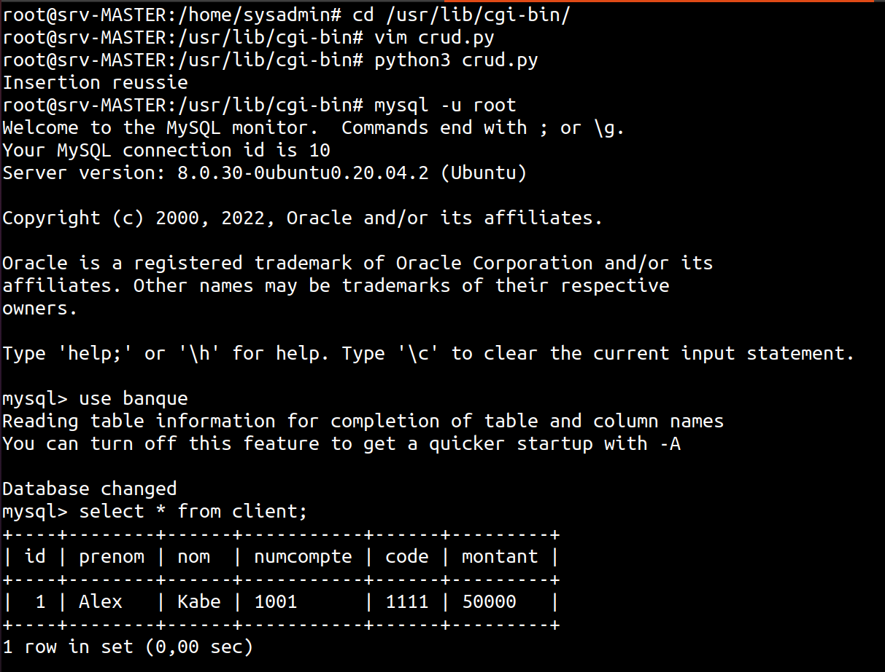

##### Cours d'administration et supervision reseaux

## ***Presentation du cour theorique (18/08/2022)***

:::tip	Important
## Quels sont les profils d'acces d'une machine windows a un reseaux ?

*	** Public: ** Partages desactives, ping bloque
*	** Prive: ** Partages actives
*	** Domaine: ** Les regles de securites sont gerer au niveau du controleur de domaine
:::

L'outil loupe est utiliser pour zoomer sont ecran.

:::info Information
Pour ouvrir le firewall on tape firewall dans la barre de recherche de windows. Cela nous permet aussi de voir les profils d'acces.
:::

## Comment autoriser a travers un parefeu une application windows ?

# Dans le parefeu windows la fenetre a gauche nous pouvons autoriser une application.


## Est-ce que ces deux machines sont dans le meme reseaux:
*	W: 192.168.3.97
*	L: 192.168.5.245
?

# On ne peut pas se prononcer tant qu'on a pas le masque reseau

Avec comme information supplementaire le masque:
- W: 192.168.3.97/21
- L: 192.168.5.245/21

On fait le calcule binaire de l'application des addresses au masque reseau et on trouve qu'ils sont dans le meme reseau.

## Interdire le ping sur linux

On passe en mode super utilisateur

Ensuite on execute la commande:

``` jsx title="bash"
iptables -A input -p icmp -j REJET
```

### ***Que faut-il maitriser dans le cadre de ce cour ? ( 24/08/2022 )***

### Gestion des equipements que RADIO

### Fonctionnement de l'environnement de travail (windows, linux)

## Fonctionnement des cartes reseaux

# Mode promiscuite:
Il permet a une carte reseaux d'accepter toutes les trames qui lui sont envoyer

# Machine virtuelle:
Pour permettre a notre machine virtuelle d'etre dans le meme reseaux que

# net-tools

``` jsx title="bash"
ifconfig
```
Permet de voir nos cartes reseaux

``` jsx title="bash"
iwconfig 
```
Permet de voir les cartes Wi-Fi

``` jsx title="bash" 
iwlist <nom de la carte>
```
Permet de lister les canaux supporter par la machine

:::info Information
Une bande de frequence a ete laisse pour les gens qui fabriquent des equipements pour les industries les scientifiques et pour le medical. Cette bande s'appelle ISM.
ISM: Industrie Scientifique Medical ( 2 bandes ISM: 2,4 GHz et 5 GHz )
:::

``` jsx title="bash"
iwlist <nom de la carte> scan
```
Pour afficher les Wi-Fi disponible et les informations dessus.

Si Mode == "Master" (Insfrastrure) alors ce reseau est un point d'acces

Si Mode == "" (Point a point) alors ce reseau est un point a point

:::info Information
En Wi-Fi une frequence occupe 11MHz a gauche et 11MHz a droite donc il est conseiller d'utiliser une ecart de 5 unites ( MHz ) lorsque deux finis sont proches.
La premiere frequence est: 2,412 GHz
***La formule pour calculer la frequence de la ieme canal: fi = f1 + (i-1) * 0,005***
:::

## Le fonctionnement d'un switch:
*	table de commutation
*	Algo de reception de trames pour un switch

:::info Information
*	Port mirroring ( Le fait de copier toutes les trames envoyer sur les autres ports et les envoyer sur un autre port qui est port ou je veux placer une outils de supervision )
*	Port forwarding ou port mapping est le nom donné à une technique de transfert de données d'un port d'un nœud vers un autre nœud. Essentiellement, les données sont interceptées et redirigées d'un ordinateur à un autre. La redirection de port est utilisée dans les scénarios où vous souhaitez accéder à un appareil en réseau ou à un service connecté à Internet à partir d'un emplacement distant.
:::

:::tip Contraste 

***Lien entre les concepts entre le fonctionnement de la carte reseaux et les concepts de port mirroring et port Forwarding***

Promiscuite: La trame va accepter toutes les trames memes celle qui ne lui sont psa desiner

Port mirroring:

:::

## Pare-feu et filtrage sous linux

Les deux outils qu'on va utiliser:
*	iptables
*	ufw

Pour lister les regles de securite `iptable -L`

:::tip Important
Le noyau du SE fabrique les datagrammes ip. Lorsqu'un routeur recoit une datagramme ip il diminue le champt *TTL* d'une unite. Lorsque ce champs atteint zero ce datagramme est detruit.
:::

Ajouter une regle qui bloquer tous les ping:
``` jsx title="bash"
iptables -A INPUT -p icmp -j REJET
```

Supprimer toutes les regles:
``` jsx title="bash"
iptables -F
```

Ajouter une regler qui bloque tous les ping sauf pour une machine:
``` jsx title="bash"
iptables -A INPUT -p icmp ! -S 192.168.7.25 -j REJET
```

Pour afficher l'etat du service ufw:
``` jsx title="bash"
systemctl status <nom du service>
```

Pour activer ou desactiver une service:
``` jsx title="bash"
systemctl enable/disable <nom du service>
```

Pour masquer une service:
``` jsx title="bash"
systemctl mask/unmask <nom du service>
```

:::tip Cas d'utilisation de `mask/unmask`
Si on doit mettre en place un serveur de telephonie sur ip et qu'on utlise *Asterisk* et *FreeSwitch* on peut masquer un service pendant qu'on travaille sur l'autre et apres inverser pour qu'ils n'utilisent pas les memes ports.
:::

## Outils d'analyse de trames:
*	Wireshark
*	Telnet

:::tip Installation
*	Wireshark
`sudo apt install wireshark`

*	Telnet
`sudo apt install telnetd`
:::

:::info Information
Sous linux le "d" a la fin du nom d'un paquet signifie que c'est un paquet serveur. Il existe aussi son omologue sans le "d" qui signifie que c'est le paquet client.
:::

:::info Information
La commande: `apt policy <nom du paquet>` est utiliser pour savoir si le paquet est installer.
:::

Pour afficher les connexions réseau, les tables de routage, les statistiques des interfaces, les connexions masquées, les messages netlink, et les membres multicast. On filtre les avec les lignes contenant "23" ( Port de telnet )
``` jsx title="bash"
netstat -anp | grep -w 23
```


:::tip Pour qu'un client puisse acceder a un service
*	Adresse IP du serveur
*	Port de serveur
*	Potrocole de transport
:::

:::danger Important !
*	Si un protocole utlise udp, c'est qu'il n'est pas sensible au erreur.
*	Si un protocole utilise tcp, c'est qu'il est sensible au erreur. 
:::

Pour installer le serveur ssh:
``` jsx title="bash"
sudo apt install openssh-server
```

Pour se connecter avec ssh sur une machine:
``` jsx title="bash"
ssh <nom d'utilisateur>@<adresse de la machine>
```

:::tip Important
Pour savoir qui est connecter sur la machine: `who`

Pour savoir qui fait quoi sur la machine: `w`
:::

**Wireshark**


### I- Principes de mise ne place d'un service reseaux ***(25/08/2022)***

## 1- Comprendre l'interet du service

:::info Exemple
*	Le service Telnet permet la connexion a distance

*	Le service SSH permet la connexion a distance securse
:::

## 2- Connaitre les entites du service

## 3- Connaitre les protocoles du service

## 4- Connaitre les differents types de messages echanges par les entites du service

## 5- Connaitre le format de chaque message

## 6- Intallation selon le cas:

*	Windows Server

:::info Que faire ?

*	On active: le service
*	On parametre graphiquement (Connaitre les principaux parametres du service et leur signification)
*	Apprendre a utiliser le service

:::

*	Linux

:::info Que faire ?

*	Connaitre les noms des paquets a installer
*	On installe les paquets(\*)


***3 grandes methodes:***

*	M1: Le paquet est connu par la distribution
*	M2: Le paquet est archive
*	M3: 
	-- Installation de la cle du logiciel;
	-- Installer le lien de telechargement du logiciel
	-- `apt update ; apt install <nom du logiciel>`
:::

## 7- Configuration selon:

*	Linux: Identifier les fichiers de configuration, identifier les parametres du service, parametrer et redemarrer le service.


### Pratique

## Maitrise de l'environnement Linux 

Pour qu'un utilisateur deja creer puisse utiliser la commande `sudo` il faut l'ajouter dans le groupe sudo avec la commande:
``` jsx title="bash"
gpasswd -a <nom d'utilisateur> sudo
```

Pour supprimer un utilisateur d'un groupe on fait:

``` jsx title="bash"
gpasswd -d <nom d'utilisateur> <nom du groupe>
```

Pour nommer un utiilisateur administrateur d'un groupe:
``` jsx title="bash"
gpasswd -A <nom d'utilisateur> sudo
```

## Analyse des trames

*	Se familialiser avec l'encapsulation
*	Sensibiliser les apprenants sur les problemes de securite de certaines applications
*	Se familialiser avec certains services reseaux (Telnet, SSH, mysql, FTP, messagerie, DNS, DHCP, TFTP, LDAP, ...)

:::info Remarque !

Sous linux, un service peut etre autonome ou non autonome. Si un service est non-autonome il est gerer par le super deamon`init`

:::

:::tip Important
On peut trouver tous les services confier on regarde le fichier: `/etc/inetd.cnf`
:::

## Telnet

Il n'est pas securise, il fonctionne en mode caractere.

## SSH

Il est securise

## FTP

Il fonctionnee en mode message

:::tip Clients
filezilla & winscp
:::

:::info Information
On se pose deux questions:
*	Autoriser les utilisateurs anonymes a se connecter ?
*	Faut-il autoriser les utilisateurs ayant un compte a se connecter ?
*	Faut-il bloquer l'utilisateur dans son dossier personnel ?
:::

Le fichier de configuration du serveur: `/etc/vsftpd.conf`

:::danger Parametres

``` jsx title="bash"
anonymous\_enable=NO
local\_enable=YES
write\_enable=YES
#chroot\_local\_user=YES
```
:::

## Exercice:

Confiner un utilisateur dans son repertoire personnel avec FTP (vsftpd)

## Installation et utilisation du client ftp filezilla

*	`sudo apt install filezilla`
*	Lancer filezilla

:::info Conclusion
FTP n'est pas securise
Le protocol FTP
:::

## Exercice

Creer un tunnel ssh pour y faire passer des messages les messages services non securises.

## mysql

:::info Paquets
*	Client: mysql-client
*	Serveur: mysql-server
:::

:::tip Fichier de configuration
`/etc/mysql/mysql.conf.d/mysqld.cnf`
:::

Pour que notre service de base de donnees soit accessible par tous:
*Parametre:* bind-address =	0.0.0.0

Pour activer les logs:
*Parametres* 
*	general\_log\_file        = /var/log/mysql/query.log
*	general\_log             = 1

:::tip Commandes
``` jsx title="mysql"
show databases;
create database master;
create user bobo identified by "P@sser123";

grant all privileges on master.* to bobo;
flush privileges;
```
:::

Pour voir les logs, nous fesons un tail sur le fichier:
`/var/log/mysql/mysql-bin.log`


On peut faire 

``` jsx title="mysql"
create table etudiant(id int primary key AUTO_INCREMENT, prenom varchar(30), nom varchar(30), note varchar(30));

insert into etudiant(prenom, nom, note values("Cherif", "Diouf", "18"), ("Kahar", "Idrissou", "18");

```

## Apache2

``` jsx title="bash"
sudo apt install apache2
```

:::tip Dossier site
`/var/www/html/`
:::


On creer un fichier /var/www/html/test/bonjour.php avec le contenue:
``` jsx title="php"

<?php 
	echo "Bonjour les amis";
	echo "<br>" // On fait semblant de faire une erreur au niveau de cette ligne
	echo "Bonjour de nouveau";
?>
```


:::danger Important !

Pour qu'apache puisse afficher du php il faut installer le module: `libapache2-mod-php`

:::


:::info Logs d'apache2

Le ficher log c'est le:
`/var/log/apache2/error.log`

:::


:::tip Logs
	Pour regarder les fichiers de log on utilise tail -f suivis du nom du fichier pour voir la fin
:::


## Service de messagerie

Il y a deux types de messageries:
*	Mail
*	I.M. ( Messagerie Instentannee )

:::info Paquets service messagerie
*	Openfire
*	Prosody
*	Jitsi-meet
:::


## Services de messagerie classique:


:::tip Plan

1)	Installation mysql-server
*	Maitriser mysql-server
	---Securiser l'acces a root selon un mot de passe bien defini---
	---Differents plugins de gestion de mot de passe mysql---
	---Mot de passe hache---

2)	Installer les paquets postfix dovecot-pop3d dovecot-imappd roundcube roundcube-mysql
	Configuration du webmail roundcube
-	Cette config se fait en 2 etapes:
	a) Hebergement du webmail en tant qu'application WEB: Decommenter la ligne `Alias /roundcube /var/lib/roundcube` Qui depends de notre version d'ubuntu.
	Moi: `/var/lib/roundcube/config`
	On redemarre le serveur apache2: 

``` jsx title="bash"
systemctl restart apache2
```
	b) Configuration de roundcube instant client de messagerie.
:::


## 1) Agents ( Composants ) de messagerie

Il est essentiellement compose de 3 programmes appele _agent de messagerie_:
-	MUA ( Mail User Agent ): Qui s'occupe de l'ecriture ou de la lecture de mail.

:::info Exemple
Thunderbird

( On peut l'utiliser pour generer une paire de cle pour le chiffrement des messages )

:::
-	MTA ( Mail Transfer Agent ): Qui s'occupe de reception et d'envoie de mail venant des MUA ( clients )

:::info Exemple

Postfix, exim4

:::

-	MDA ( Mail Delivery Agent ): Qui s'occupe de la distrubution des mails dans les boites des users

:::info Exemple

Dovecot, cyrus-IMAP

:::

:::tip Un serveur de messagerie

Serveur de messagerie = MTA + MDA

:::

## 2) Protocoles de messagerie ( SMTP, POP, IMAP, MIME )

*	SMTP ( Simple Mail Tranfert Protocol ): 
		Qui est utiliser par 1 client ( MUA ) pour envoyer des mails a son MTA ou utiliser par MTA pour envoyer des mails a un autre MTA.

:::tip NB

Le MTA est appele serveur SMTP

:::

*	POP ( Post Office Protocol ):
		Qui permet a un client de telecharger sur sa machine les mails geres par le MDA.

*	IMAP ( Internet Message Access Protocol ):
		Qui pemet a un client d'acceder a ses mails sans les telecharger sur le post de l'utilisateur.

*	MIME ( ):
		Qui Permet d'attacher des fichiers a des mails

:::tip Format de boite a lettre

*       Format mailbox: 1 fichier contenant tous les mails de l'utilisateur
*       Format maildir: On creer 1 dossier dans lequel 1 mail est 1 fichier

:::

## 3) Mise en oeuvre 

:::danger Processus d'envoie de mail

Insert l'image de 

:::

:::tip Paquets a installer

*	`postfix` -> MTA
*	`dovecot-pop3d` -> MDA
*	`dovecot-imapd` -> MDA
*	`roundcube` -> webmail
*	`mysql -serveur` -> Base de donnees
*	`roundcube-mysql` -> Connecteur roundcube & Base de donnees

:::

# 4.1) Installation et configuration du serveur

``` jsx title="bash"

sudo apt install postfix dovecot-pop3d dovecot-imapd roundcube roundcube-mysql

```

## Postfix

:::info

Fichier de configuration: `/etc/postfix/main.cf`

:::

On change les lignes:
*	myorigin = estm.sn
*	mydestination = estm.sn
*	home_mailbox = Maildir/

Apres on redemmarre postfix pour prendre en consideration les configurations:

``` jsx title="bash"

systemctl restart postfix

```

Ensuite on va parametre le MDA dans: `/etc/dovecot/conf.d/10-mail.conf`

On mets en commentaire la ligne: `mail_location = mbox:~/mail:INBOX=/var/mail/%u`

Et on decommente: `mail_location = maildir:~/Maildir`

pres on redemmarre postfix pour prendre en consideration les configurations:

``` jsx title="bash"

systemctl restart dovecot

```

:::info Concernant apache

Si un service utilise apache, il va dans le fichier de configuration de apache ( /etc/apache2/conf-available/ ) pour y creer son fichier de configuration.

:::

## Roundcube

On va dans /etc/apache2/conf-available/roundcube.conf pour lui donner l'adresse du serveur. Pour ce faire on decommente la ligne:

` Alias /roundcube /var/lib/roundcube `

:::info Norme

Il faut allez dans le dossier de config du service web et creer un fichier `config.\*\*\*`

:::


# 4.2) Configuration d'un client

On precise l'adresse du serveur SMTP et le port d'ecoute

:::danger Attention !

Option: Certains serveurs SMTP exigent a des clients de s'authentifier avant d'envoyer de mail.

Postfix lui par defaut ne l'exige pas mais roundcube Oui

:::

On mets `estm.sn` pour le parametre `` dans ``:

Pour roundcube on peut le desactiver en enlevant le `%u` et le `%p`


# 4.3) Installer et configuration d'un webmail

// SMTP username (if required) if you use %u as the username Roundcube
// will use the current username for login
$config['smtp_user'] = '';

// SMTP password (if required) if you use %p as the password Roundcube
// will use the current user's password for login
$config['smtp_pass'] = '';

# 4.4) Gerer les contacts des utilisatuers a partir d'une base de donnees

:::tip 

Notre table contact de la base de donnees mysql contient:


:::

On peut inserer un contact directement dans mysql:

``` jsx title="sql"
mysql> insert into contacts (name, email, firstname, surname, user_id)
 values("Abdoulaye Wade","abdou@estm.sn","Abdoulaye","Wade",2);

```

Pour la correspondance on mets des lignes de ce format:

`adresse_ip nom_d_acces`


:::tip Correspondance adresse ip nom
*	Windows
On edite le fichiers C:\Windows\System32\drivers\etc\host

*	Linux
On edite le fichiers /etc/hosts
:::


Nous creons une configuration de site virtuel par nom dans apache2:

On va dans : `/etc/apache2/sites-available/`

Ou on creer un fichier site1.conf

``` jsx title="bash"
<VirtualHost *:80>
ServerName mail.estm.sn
DocumentRoot /var/lib/roundcube/
DirectoryIndex index.php
</VirualHost>
```


:::tip Activation

``` jsx title="bash"
# Activation
a2ensite site1.conf

# On recharge la configuration d'apache
systemctl reload apache2

```
:::


:::tip Securiser mysql

Apres l'installation de mysql on tape la commande:

``` jsx title="bash"
mysql_secure_installation
```

:::


### ***01/09/2022***

### Objectif:

### 1- Services avances de messagerie

## 1.1: Mettre en place une liste de diffusion

# Principe:

On envoie un mail a un abonnee et le mail est duplique vers 

On edite le fichier `/etc/aliases`

:::tip Format d'edition

`Nom-liste: email1 email2 email3`
:::

Apres on fait

``` jsx title="bash"

newaliases

```
Pour prendre en compte les nouveaux groupes de diffusion creer.

## 1.2: Redirection de mail

# Principe:

Tout mail envoye a toto soit rediriger vers bouki

:::tip Augmenter la taille des pieces jointes

`/etc/php/7.4/apache2/php.ini `

On edite la ligne: `max_file_uploads = 20`


:::

## 1.3: Repondeur automatique ( personnel )

# Principe:

Quand on envoie un message a bouki, un message automatique est renvoyer a l'expediteur.

:::tip Outils

C'est un logiciel qui permet de faire repondeur automatique:

`vacation`

Installation: 

``` jsx title="bash"

# apt install vacation

```

:::

Chaque utilisateur desirant avoir un repondeur automatique devra: 
-	Se connecter
-	Tapper:

``` jsx title="bash"

$ vacation

```
-	Personnaliser le message


***(07/09/2022)***

### Inserer un fichier csv dans une base de donnees mysql

On affiche le parametre global:

SHOW GLOBAL VARIABLES LIKE `'local_infile'`;

Si sa valeur est 'OFF' on le change pour pouvoir charger des fichiers dans mysql.

``` jsx title="mysql"
SET GLOBAL local_infile = 1;
```

`/etc/mysql/mysql.conf.d/mysqld.cnf`
On ajoute la ligne
secure-file-priv = ''


On creer un fichier csv: `fiche1` avec comme contenue:

``` jsx title="csv"
Macky,Sall,13
Ousmane,Sonko,14
Abdoulaye,Wade,17
Abdoulaye,Bathily,15,5
```

On le copie dans `/var/lib/mysql/`

``` jsx title="csv"

cp fiche1 /var/lib/mysql

```
Apres cela on mets les commandes en mysql pour charger le fichier dans la base de donnees:

``` jsx title="sql"

load data local infile './fiche1' into table etudiant fields terminated by ',' (prenom, nom, note);

```


### Application:

*	Liste d'etudiants dans un fichier excel contenant les numeros de telephones
*	Mettre un systeme telephonique ou une autorite va enregistrer
*	A un moment voulu, le systeme appelle tous les etudiants et des qu'un etudiant decroche on lui livre le message

:::tip Client SIP

*	MicroSIP
*	Blink

:::

Avec un script php on peut faire un script pour se connecter a un serveur de telephone et un autre pour recuperer les numeros dans la base de donnees.

### Planification des taches (at, cron, crontab)

## at

Il permet d'executer des taches a une date donnee.

On installe la commande:

``` jsx title="bash"

# apt install at

```

On peut planifier a 20:29 la creation d'un fichier:

``` jsx title="bash"

# at 20:29 touch fiche1

```

## crontab

Il permet de planifier des taches routinieres


:::danger
Pour qu'un programme en php puisse se connecter a une base de donnees, il faut installer le paquet:
``` jsx title="bash"

# apt install php-mysql

```
Et pour utiliser php en ligne de commande on installer:

``` jsx title="bash"

# apt install php.cli

```

:::

Pour que php se connecte a une base de donnees:

``` jsx title="php"

<?php
	$conn = mysqli_connect("localhost", "bouki", "P@sser123", "ecole");
	$req = "INSERT INTO etudiant(nom, prenom) VALUES ("Diouf", "Cherif"), ("Diouf", "Aicha");

	$result = mysqli_query($conn, $req);
	mysql_close($conn);
?>

```

:::info mysqli

`mysqli` est une version ameliorer de mysql

:::


***08/09/2022***

### Approfondir le service WEB

Cela a travers le concept de CGI ( Common Gateway Interface ) permettant d'executer n'importe quel programme externe (C, python, ...)


A faire:
*       Ecrire des programmes en python se connectant a une base de donnees
*       Preparation de l'environnement de developpement

:::tip Installation

On aura besoin de ces paquets: `python3 mysql-server python-mysqldb `

``` jsx title="bash"
apt install python3 python-mysql-db mysql-server
```

:::


Afficher les utilisateurs de mysql

``` jsx title="sql"

SELECT User, Host FROM mysql.user;

```

:::tip CGI

Les CGI se trouve dans: `/usr/lib/cig-bin/`

:::

## Methode a suivre pour ecrire une application python de connection a mysql
#	1- Preparer la requete dans une variable.
#	2- Se connecter a la base.
#	3- Executer la requete.
#	4- Eventuellement recuperer les resultats pour exploitation


On creer notre script python `crud.py`


``` jsx title="python"
  
#!/usr/bin/python3

import MySQLdb

def database():
    global conn, curseur
    conn = MySQLdb.connect(user="toto", passwd="passer", db="banque")
    curseur = conn.cursor()
    return conn, curseur

def inserer(prenom, nom, numcompte, code, montant):
    req = "INSERT INTO client (prenom, nom, numcompte, code, montant) values(%s, %s, %s, %s, %s)"
    database()
    val = (prenom, nom, numcompte, code, montant)
    curseur.execute(req, val)
    conn.commit()
    print("Insertion reussie")


inserer("Alex", "Kabe", "1001", "1111", "50000")

```
# Resultat

Nous voyons que le script a reussi a executer la requete:




## CGI

Pour faire du CGI il faut activer le CGI: 

``` jsx title="bash"

a2enmod cgid

```


et on redemarre le serveur web:

``` jsx title="bash"

systemctl restart apache2

```

Il faut trouver le dossier dans le quel on va mettre le script:
On peut verifier le fichier: `/etc/apache2/conf-available/serve-cgi-bin.conf`

``` jsx title="bash"

cat /etc/apache2/conf-available/serve-cgi-bin.conf

```

On peut voir a son contenue: 

``` jsx title="bash"

<IfModule mod_alias.c>
	<IfModule mod_cgi.c>
		Define ENABLE_USR_LIB_CGI_BIN
	</IfModule>

	<IfModule mod_cgid.c>
		Define ENABLE_USR_LIB_CGI_BIN
	</IfModule>

	<IfDefine ENABLE_USR_LIB_CGI_BIN>
		ScriptAlias /cgi-bin/ /usr/lib/cgi-bin/
		<Directory "/usr/lib/cgi-bin">
			AllowOverride None
			Options +ExecCGI -MultiViews +SymLinksIfOwnerMatch
			Require all granted
		</Directory>
	</IfDefine>
</IfModule>

```


:::danger Attention

En HTTP il est obligatoire de laisser une vide entre l'entete et le corps

:::

On creer un script python que l'on rend executable qui permet d'afficher du text sur le navigateur:

``` jsx title="python"

#!/usr/bin/python3

print('Content-Type:text/plain')
print() # En HTTP il est obligatoire de laisser une vide entre l'entete et le corps
print("Les noirs 2.0 respectent maintenant les regles ! Bravo a eux")


```

### Resume

### Etudie les reseaux

*	Etude des equipements
*	Etude des logiciels

### Logiciels:
##	Utiliser les emulateurs tel que GNS3 pour la maitrise du fonctionnement des equipements tels routeurs, switches, firewall.
##	L'utilisation des plateforme de virtualisation (VMWare et Virtualbox) permet de mettre en oeuvre des concepts qu'on trouve tous les jours en entreprise

:::tip Exemple

* Redirection de ports
* Mode promisc
* Supervision necessite
* NAT
* Carte en mode promisc
* Le port mirroring et le port forwarding

:::

## SGBD

*	Journalisation
*	Commit
*	Chargement de donnees a partir de fichier

## Serveur web

*	Journal (error.log)
*	Modules (cgid)
*	Sites virtuels par nom

## Connexion a distance & tranfere de fichiers

*	SSH
*	Telnet
*	SCP
*	WinSCP
*	Firezilla
*	vsftpd
*	Securite de transaction ( Mode texte *Telnet* & Mode message *SSH* )

## Developpement

*	Python ( Combiner avec une base de donnees )
*	PHP ( Combiner avec une base de donnees )

## Administration

*	Gestion des fautes
*	Gestion des configurations

:::tip Exemple

*	Mettre en place un serveur TFTP
*	Configurer un routeur
*	Sauvegarder la configuration du routeur
*	Simuler une panne, remplacer le routeur
*	restaurer la configuration

:::

*	Gestion de l'utilisation
*	Gestion de la performance

:::info Performance

On install l'outil lm-sensors:

``` jsx title="bash"

sudo apt-get install lm-sensors

```

Et on affiche la temperature avec:

``` jsx title="bash"

sudo sensors-detect

```

:::

*	Gestion de la securite

### Supervision ( adhoc & SNMP )

## Methode adhoc


## Protocole SNMP

### Equipements

## GNS#

On installe GNS3

``` jsx title="bash"

sudo add-apt-repository ppa:gns3/ppa
sudo apt update                                
sudo apt install gns3-gui gns3-server

```

On peut telecharger l'OS d'un router sur ce site:

[](http://tfr.org/cisco/37xx/3745/)


:::info Remarque

Si on met un module sur le Slot 1 tous les interfaces de ce module commence par le chiffre 1

:::

Sur le commutateur pour activer le port mirroring:

``` jsx title="cisco"

R1(config)#monitor session 1 source interface f1/0 both 
R1(config)#monitor session 1 source interface f1/2 both 
R1(config)#monitor session 1 destination interface f1/1

```

Un switch a 4 memoires: NVRAM, Flash, ...

Si on mets une nouvelle memoire on doit la formater avec 

``` jsx title="cisco"

erase flash

```

GNS3 est un logiciel ...

:::danger

Un vlan est un domaine de diffusion, deux PCs n'appartenant pas a un meme vlan ne peuvent pas se joindre par PING.

:::


Ca ne marche pas. Parce que les messages ARP de diffusion ne rejoignent pas l'autre machine ...


### ***(22/09/2022)***
### TP gestion de la sécurité
L’objectif de ce TP est d’utiliser les outils pour mettre en œuvre la gestion de la
securité dans le contexte d’un cours d’administration réseaux.
On s’appuiera sur les techniques de filtrage des firewall et des outils tels que :
iptables, fail2ban,portsentry,ufw,rkhunter


## Fail2ban

:::tip Utilisation

Fail2ban est utilise pour generer des regles de securite pour bannir un utilisateur qui tente d'accepter a un service apres plusieurs tentatives.

:::

``` jsx title="bash"

apt-get install fail2ban portsentry

```

On edite le fichier `/etc/fail2ban/jail.local`

Et pour surveille ssh et ftp on met:

``` jsx title="bash"

[sshd]
enabled = true
port = 22
filter = sshd
logpath = /var/log/auth.log
maxretry = 3

[vsftpd]
enabled = true
port = ftp,ftp-data
filter = vsftpd
logpath = %(vsftpd_log)s
maxretry = 3

```

:::info Arreter un processus

Sans utiliser `systemctl` ni `service`:

``` jsx title="bash"

killall vsftpd

```

:::


## Portsentry

:::tip Utilisation

Portsentry peut etre utiliser dans le cas ou un attaquant tente de scanner les ports ouvert sur notre machine.

:::


:::danger VMware & Virtual box

*	Comment est-ce qu'on allege les regles de securite sur VMware et virtual box

:::


:::tip Bonus

*       Comment generer et lire des codes QR
*       Comment detecter un objet sur une camera
*       IA

:::

On install

``` jsx title="bash"

apt install qrencode

```
On peut l'utiliser pour cacher un message dans une images:

``` jsx title="bash"\

qrencode -0 image.png "Ceci est un secret"

```


