Travaux pratiques
=================


### Surveillance des logs

## Les tentatives d'acces
En tapant cette commande nous avons les lignes qui contienent toutes les tentatives d’accès echoue au serveur:
``` jsx title="bash"
cat /var/log/auth.log | grep "authentication failure"
```

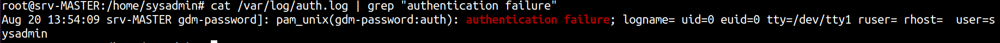

## Erreurs, bugs, informations ...
``` jsx title="bash"
ls /var/log
```

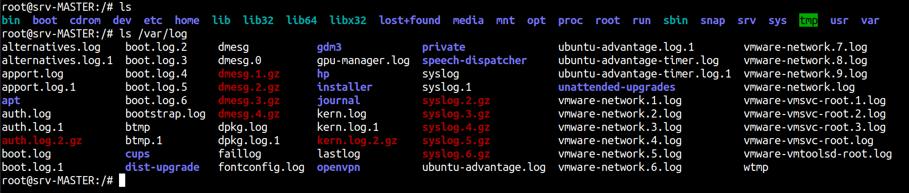

``` jsx title="bash"
sudo cat /var/log/syslog
```

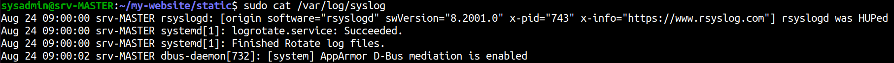

## Le log d’alerte du service fail2ban

:::info Information
Installation de fail2ban

`sudo apt install fail2ban`
:::

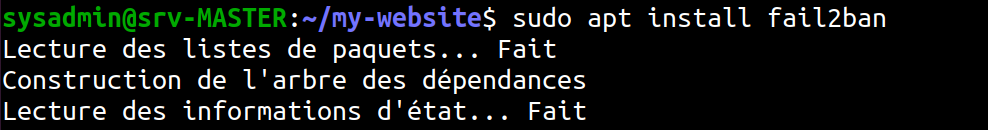

``` jsx title="bash"
sudo cat /var/log/fail2ban.log | grep ban
```
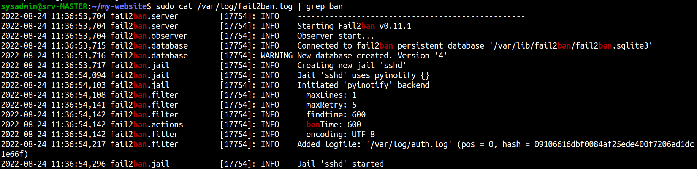

## Detecteur d’intruision: Snort

```jsx title="bash"
sudo cat /var/log/snort/alert
```

:::info Information
Je n'ai pas installer snort
:::

## Un detecteur de programme qui accède frauduleusement à un système: rkhunter

:::info Information
Installation de rkhunter

`sudo apt install rkhunter`
:::

Pour faire une verification nous tappons en ligne de commandes:

``` jsx title="bash"
sudo rkhunter --checkall
```
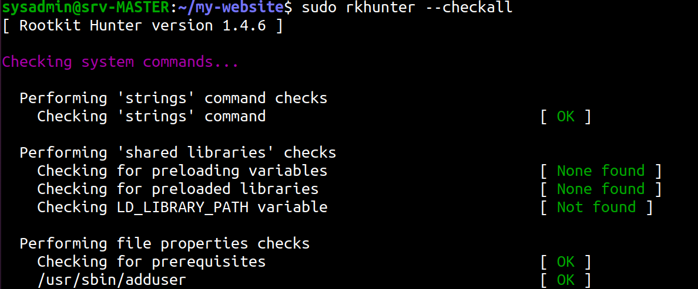

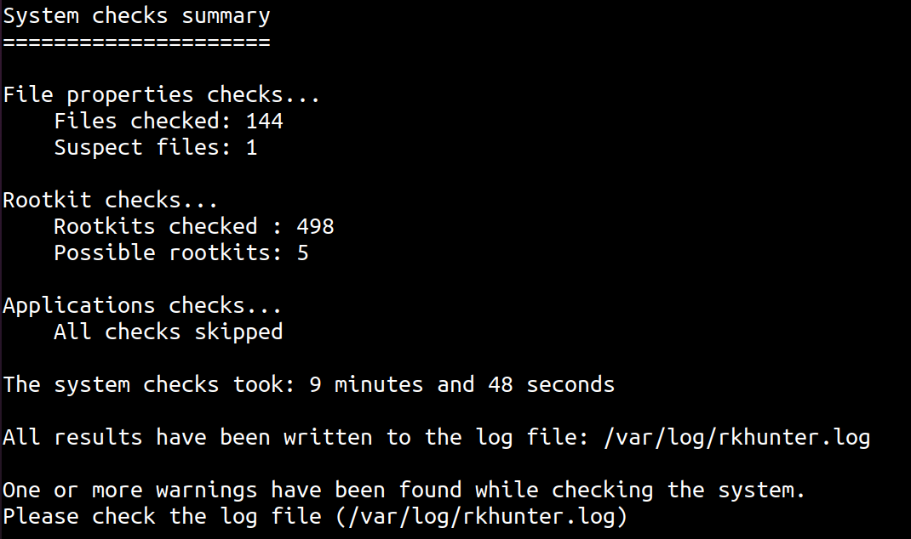

Apres cela nous pouvons regarder le fichier `/var/log/rkhunter.log`

``` jsx title="bash"
sudo cat /var/log/rkhunter.log
```

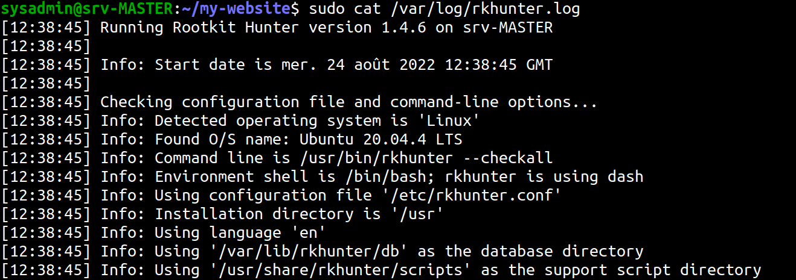

### Surveillance de log de services de base

:::tip Installation
Pour cette partie nous aurons besoin de ces services:
*	Base de donnees
*	Serveur web
*	Serveur de mail
*	Serveur FTP
:::


## Activation du fichier log de mysql

:::tip Installation
On peut installer le serveur mysql avec cette commande:
``` jsx title="bash"
sudo apt install mysql-server
```
Son fichier de configuration: `/etc/mysql/mysql.conf.d/mysqld.cnf`
:::

# Activons les logs:
*	***Avant***

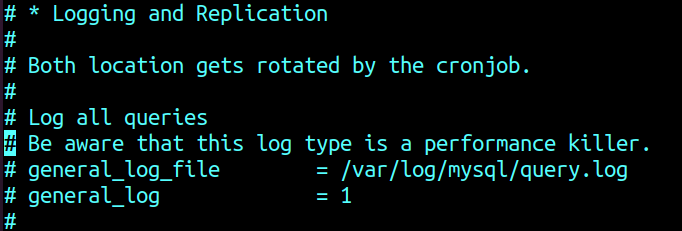

*	***Apres***

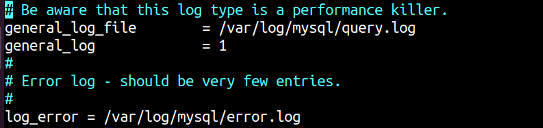


Apres l'activation on redemarre le service pour que les changements puissent etre prise en compte:

``` jsx title="bash"
service mysql restart
```

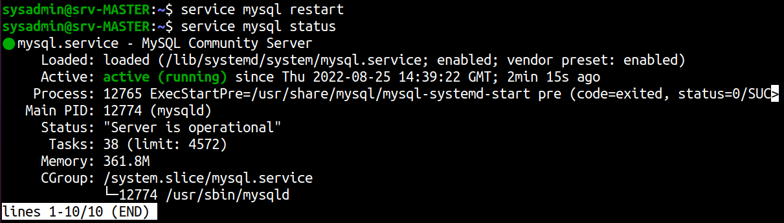


